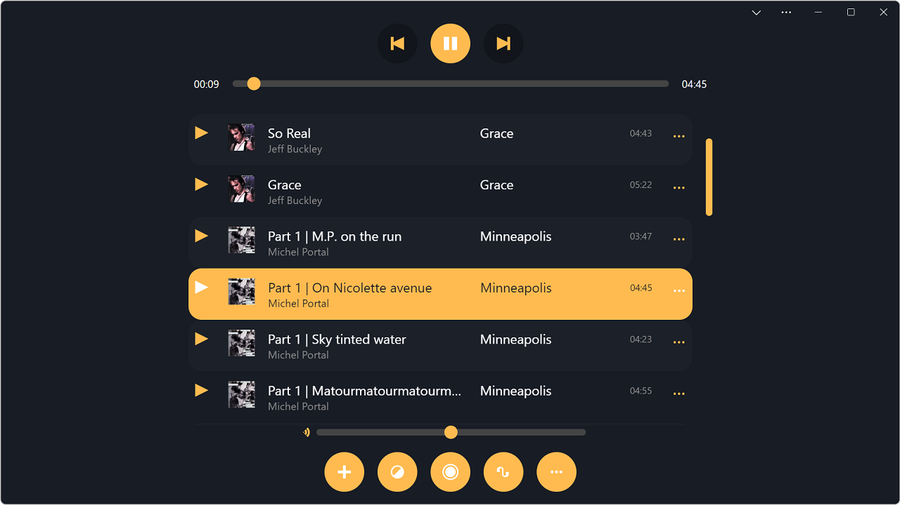

# pwa-music-player is a funetuned version of PWAmp app on 
➡️ **[Open the demo](https://microsoftedge.github.io/Demos/pwamp/)** ⬅️

pwa-music-player is a web audio player demo application. It is an installable web app (PWA) specifically made to demonstrate progressive web application.

    [Example song link](web+amp:remote-song:ia803003.us.archive.org/17/items/78_by-the-light-of-the-silvery-moon_fats-waller-and-his-rhythm-fats-waller-the-dee_gbia0153541a/BY%20THE%20LIGHT%20OF%20THE%20SILVERY%20-%20%22Fats%22%20Waller%20and%20his%20Rhythm.mp3)
  
## Making a new skin

A skin is a CSS file that gets applied to the app, replacing the default CSS.

The best way to make a new skin is to open DevTools and look at the HTML structure of the page. Most elements should have handy classes and IDs that will make them easy to style.

Skins are expected to have a `:root {}` rule with at least one variable called `--back` set to the color of the background. This will be used at runtime, in JavaScript, by the app to apply the color to the visualizer and the title bar area.

## Song credits

The first time you open the app, a few songs are pre-loaded. These are remote URL songs, so they will only play when you are online.

Credits for those songs:

* "Reunion", and "Over The Stargates" by David Rousset, used with the author's approval. More information and songs on [soundcloud](https://soundcloud.com/david-rousset).
* "Opening" and "Aloe-Almond Butter And Space Pesto" by Noi2er, from the [Internet Archive](https://archive.org/details/DWK382).

## TODO

* Make sure the app is accessible in high-contrast mode.
* Make it possible to download remote songs locally (fetch -> readablestream -> store chunks in IDB. And then fetch handler in SW to serve these chunks back from IDB when offline).
* Improve song adding performance again: only get duration later, after song has been added.
* Add the ability to drag/drop songs in the playlist to re-order them.
* Ability to export as another file format.
* Use viewport segments to display on dual screen devices.
* Add repeat and shuffle buttons.
